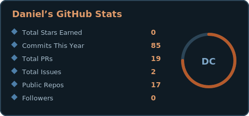
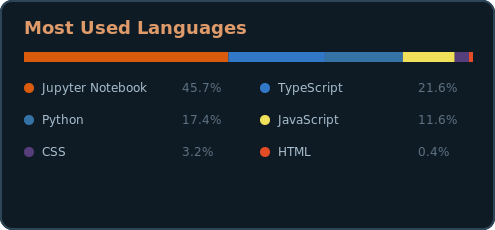
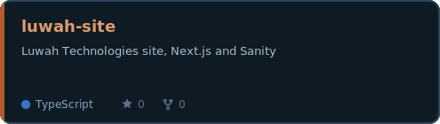
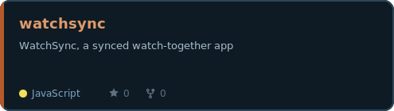
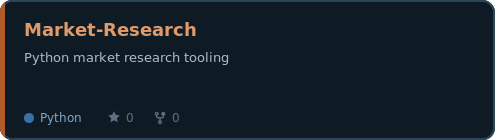
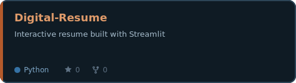
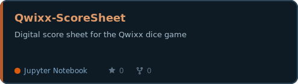
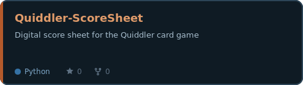

- 🏥 Senior Data Engineer at UnitedHealthcare, building cloud-native healthcare data platforms
- ❄️ Snowflake, Databricks, and Azure ML subject matter expert
- 🔭 Currently building Luwah Technologies sites and apps
- 🏠 Homelab: Proxmox cluster plus a 3-node k3s Kubernetes cluster, with encrypted 3-2-1 backups
- 🎓 B.S. Computer Science, Colorado State University
- 💬 Ask me about medallion architecture, Airflow, Next.js, or self-hosting

<table>
<tr>
<td>

</td>
<td>

</td>
</tr>
<tr>
<td>

</td>
<td>

</td>
</tr>
<tr>
<td>

</td>
<td>

</td>
</tr>
</table>

